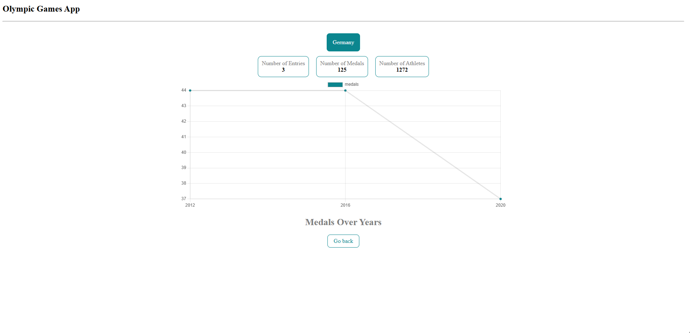

# Projet 2 : Architecture de la solution Olympic Games App

## Contexte global

Ceci est une application développée dans le cadre du Projet 2 de la formation "Développeur Full-Stack - Java et Angular" de l'organisme OpenClassrooms. Ce projet a pour but de représenter des données, sur différents pays, liés à leurs participations à certains jeux olympiques et afficher des détails de ces participations par pays. Ce projet utilise un fichier JSON comme source de données mais l'objectif était d'en faire une architecture maintenable et évolutive pour par la suite utilisé une API et implémenter de nouvelles fonctionnalités.

## Arborescence du projet

```text
src/app/
│
├── components/
│   ├── spinner/
│   │   ├── spinner.component.ts
│   │   ├── spinner.component.html
│   │   └── spinner.component.scss
│   │
│   ├── header/
│   │   ├── header.component.ts
│   │   ├── header.component.html
│   │   └── header.component.scss
│   │
│   ├── data-card/
│   │   ├── data-card.component.ts
│   │   ├── data-card.component.html
│   │   └── data-card.component.scss
│   │
│   ├── chart-container/
│   │   ├── chart-container.component.ts
│   │   ├── chart-container.component.html
│   │   └── chart-container.component.scss
│   │
│   └── back/
│       ├── back.component.ts
│       ├── back.component.html 
│       └── back.component.scss 
│
├── models/
│   ├── data-card.ts
│   ├── olympic.ts
│   └── participation.ts
│
├── pages/
│   ├── country/
│   │   ├── country.component.ts
│   │   ├── country.component.html
│   │   └── country.component.scss
│   │
│   ├── home/
│   │   ├── home.component.ts
│   │   ├── home.component.html
│   │   └── home.component.scss
│   │
│   └── not-found/
│       ├── not-found.component.ts
│       ├── not-found.component.html
│       └── not-found.component.scss
│
├── services/
│   └── data/
│       └── data.service.ts
│
│
├── state/
│   └── loading-state.ts
│
├── app.component.ts (App-root)
├── app.component.html
├── app.component.scss
└── app.module.ts
```


# Description de la nouvelle implémentation d’architecture

## Remarques globales
  - N'étant pas forcément dans le scope du projet, certains composants ont été implémentés dans des branches qui n'ont pas été merge à la main branch et sont considérés comme des évolutions possibles pour que le code respecte des principes SOLID.
  - AppComponent contient uniquement un titre de l'application qui sera affiché en header tout ces composants pages enfants directs (HomePage, CountryPage, NotFoundPage). Il est aussi le premier composant ou le service est injecté dans le constructeur.

## Adapters (Evolution)
### chart-adapter
Rôle : Classe permettant de réduire le lien entre la librairie CharJS et le composant qui affiche le chart. Si ChartJs ne prend pas tous les besoins graphiques que l'on souhaite, le ChartAdapter nous permet d'adapter nos nouveaux besoins graphiques dans une nouvelle version en appelant une autre librairie. Pour cela, on pourrait fournir un paramètre qui permet de savoir à quelle librairie l'Adapter doit faire appel.


## Components
### back
Rôle : Composant permettant de revenir au menu HomePage.
Composant utilisé dans la CountryPage et dans la NotFoundPage.

### chart-container


Rôle : Affiche le Chart, ainsi que sa légende (son titre).
- Fournit les données pour dessiner le Chart avec ChartJS grâce aux inputs que son parent lui fournit.
- Récupère la référence du canvas HTML pour la fournir à ChartJS afin qu'il dessine le Chart.

### header


Rôle : Affiche le titre et les DataCards liées aux données récupérés par le service utilisé par le composant page courant.
- Fournit un tableau de DataCard au DataCardComponent qui va gérer le render de celles-ci.

## Factories

### chart-factory (Evolution)
Rôle : Classe se chargeant de la création des Charts de l'application. Permet au chartContainer d'avoir comme unique responsabilité de render le composant et de passer en paramètres l'élément canvas de l'HTML et le type de chart voulu pour la Factory.

## Models

### data-card
Rôle : Interface qui représente la structure stocké par le DataCardComponent avec un label (string) et une value (number ou string).

### olympic
Rôle : Interface qui mappe la réponse liée à toutes les données dans le olympic.json de tous les pays (HomePage).

### participation
Rôle : Interface qui mappe la réponse liée aux données d'une participation d'un pays (surtout utilisé dans le CountryPage mais aussi présent dans l'interface Olympic).


## Pages

### HomePage


Rôle : Container principal de tous les composants de la HomePage (HeaderComponent, ChartContainer).
- Récupère les données en faisant un subscribe sur le DataService injecté dans le composant.
- Transmet les données à ses enfants (HeaderComponent, ChartContainer).


### CountryPage




Rôle : Container principal de tous les éléments de la CountryPage (Composant HeaderComponent, ChartContainer, BackComponent).
- Récupère les données en faisant un subscribe sur le DataService injecté dans le composant.
- Transmet les données à ses enfants (HeaderComponent et ChartContainer).


### Not Found Page


Rôle : Container principal de tous les éléments de la NotFoundPage (titre et BackComponent). On tombe dessus lorsque l'on précise un URL ayant un id ne correspondant pas à un pays dans le fichier JSON.


## Services
### dataService

Rôles : 
- Service Angular qui sert à charger, stocker et fournir les données du olympic.json à toute l'application (HomePage et CountryPage principalement).
- Gérer les états de chargement.
- Se sert d'un BehaviorSubject de LoadingState pour récupérer les données et gérer les états de chargement.
Remarques : 
- Certaines méthodes ne sont pas utilisées dans le service actuellement.
- Composant injecté à la racine de l'application et est donc disponible dans toute l'application en une seule instance (Singleton).
- Si dans le futur, le fichier JSON était remplacé par une API, il suffirait de changé l'URL stocké dans le service et revoir les différentes méthodes en précisant les endpoints précis de l'API pour chaque méthode. Il faudrait donc adapter la logique de mapping à chaque méthode et possiblement créer de nouvelles classes modèles afin de réprésenter les différentes réponses (JSON ou XML) de l'API intérrogée.

## State

### loading-state

Rôle : Définit le modèle d'état de chargement de mes données (interface et type énuméré). Permet de centraliser la gestion des états (State pattern) et rendre le code plus propre et plus maintenable.
Remarques : 
- Contient un type énuméré LoadingStatus pouvant prendre 4 valeurs : 'empty', 'loading', 'loaded', 'error'

## Templates

### data-card
Rôle : Composant stockant un tableau de modèles DataCard et affiche le label et la valeur de chacun d'entre eux dans un div spécifique en itérant sur le tableau.

### spinner
Rôle : Composant spinner affiché pendant le chargement des composants d'une page (HomePage, CountryPage).


